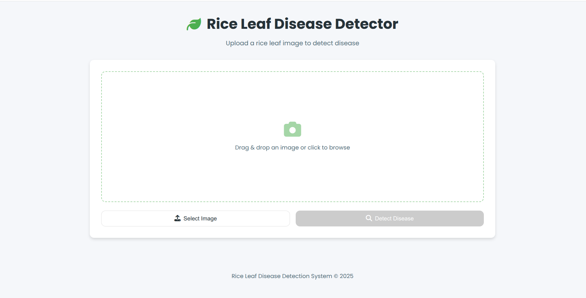
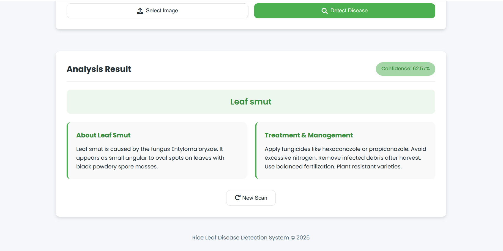

# Rice Leaf Disease Detection - MLOps Pipeline

**Rice Leaf Disease Detection using MLOps** | This project applies deep learning CNN to detect rice leaf diseases while following **MLOps best practices**, and leverages **DVC for data versioning**.

---

## **Workflow Overview**

This project follows an **MLOps pipeline** with clearly defined stages:

1️⃣ **Update `config.yaml`** → Define project configurations  
2️⃣ **Update `params.yaml`** → Set hyperparameters and model settings  
3️⃣ **Update the Entity** → Create structured entity classes for data handling  
4️⃣ **Update the Configuration Manager (`src/config`)** → Manage configurations efficiently  
5️⃣ **Update the Components** → Implement modular ML components (data processing, training, evaluation)  
6️⃣ **Update the Pipeline** → Integrate all components into a seamless pipeline  
7️⃣ **Update `main.py`** → Entry point to trigger the pipeline  
8️⃣ **Update `dvc.yaml`** → Define DVC pipeline stages for data and model versioning

---

## **Getting Started**

### **🔹 Setup Environment**

```bash
# Clone the repository
git clone https://github.com/lokk798/rice-leaf-disease-mlops.git
cd rice-leaf-disease-mlops


# Install dependencies
pip install -r requirements.txt
```

# Run the App

```bash
python app.py
```

### **🔹To Set Up DVC**

```bash
# Initialize DVC
dvc init
```

### **🔹 To Run the Pipeline**

```bash
dvc repro
```

## App Screenshots

### Image Upload



### Prediction Result


